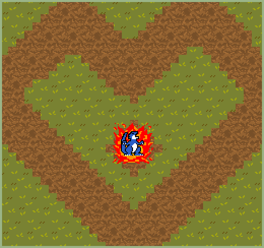

# (TODO: your game's title)

Author: Ziqi Ye

Design: Player can control a dragon to burn all the grass!

Screen Shot:

How My Asset Pipeline Works:

- My asset pipeline starts by loading pngs and fill four colors to a palette, then slicing them into tiles if the png resolution is higher than 8 \* 8;
- By comparing each pixel's color with the palette's color, the pipeline convert glm::u8vec4 to binary bits in tile_table;
- Also, there's draw_sprite() and draw_background_tile() function to draw different tile_table;
- Those two functions require a DrawInfo struct as parameter, which contains some useful information like which palette to use and which tile_table to draw.

Here's the source file I drew:
[link](asset/dragon.png)
[link](asset/dragon_attack.png)
[link](asset/grass.png)
[link](asset/soil.png)
[link](asset/fire_01.png)
[link](asset/fire_02.png)

How To Play:

(TODO: describe the controls and (if needed) goals/strategy.)

This game was built with [NEST](NEST.md).
